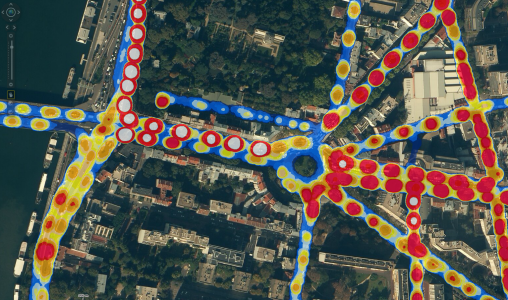

```{r setup, include=FALSE}
knitr::opts_chunk$set(echo = FALSE)

```

## Projet : description

  - Utiliser un jeux de données satellite provenant de capteurs (Luxmètre)
  - Cartographier l'état du système de lumière sur les routes d'Istanbul
  - Une équipe de six étudiants de l'ESIGELEC - BIG DATA

<center>

</center>

## A notre disposition :

  - Quatre fichiers de données de type .csv
  - Information GPS : TUREF/TM30 : ESPG5254 (Turkish National Reference Frame)
  - Les positions des capteurs par rapport au recepteur GPS
  - Formalisme mathématique du comportement des capteurs

## Action

  - Etude des données et des élements mis à notre disposition
  - Etablissement d'une marche à suive
  - Attribution des rôles
  - Devellopement/Configuration machine
  - Agrégation
  - Représentation des données sur un SIG
  - Interpretations des résultats

## Faire le lien entre les différents TimeStamp

  Dans un premier temps nous devons charger quelques packages

```{r echo=TRUE, message=FALSE, warning=FALSE, paged.print=FALSE}
library("plyr") 
library("dplyr")
library("data.table")
library("zoo")
library("rgdal")
library("ggplot2")
library("ggmap")
```

##  Chargement des fichiers .csv

```{r echo=TRUE, message=FALSE, warning=FALSE, paged.print=FALSE}
GPS <- fread("DATA_Debut/GPS.csv", header = FALSE, sep=";")
ch0 <- fread("DATA_Debut/ch0.csv", header = FALSE, sep=";")
ch1 <- fread("DATA_Debut/ch1.csv", header = FALSE, sep=";")
ch2 <- fread("DATA_Debut/ch2.csv", header = FALSE, sep=";")
```

##  Tri dans les données GPS

```{r echo=TRUE, message=FALSE, warning=FALSE, paged.print=FALSE}  
GPS <- data.frame(TimeStamp=GPS[,1], lat=GPS[,3], lon=GPS[,4])
```

##  Nommage des colonnes
  
```{r echo=TRUE, message=FALSE, warning=FALSE, paged.print=FALSE}    
names(ch0) <- c("TimeStamp", "V1_ch0", "V2_ch0")
names(ch1) <- c("TimeStamp", "V1_ch1", "V2_ch1")
names(ch2) <- c("TimeStamp", "V1_ch2", "V2_ch2")
names(GPS) <- c("TimeStamp", "lat", "lon")
```

##  TimeStamp intermediaire capteurs

  La première grande étape consiste à recréer un TimeStamp intermédiaire pour les données des capteurs
  Ensuite, nous relions les V1 au TimeStamp original et les V2 au TimeStamp intermediaire

```{r echo=TRUE, message=FALSE, warning=FALSE, paged.print=FALSE}    
source("TimeStamp_ch.R")
ch <- TimeStamp_ch(ch0, ch1, ch2)
```
  
##  TimeStamp intermediaire GPS

  Pour la précision

```{r echo=TRUE, message=FALSE, warning=FALSE, paged.print=FALSE}    
source("TimeStamp_GPS.R")
GPS <- TimeStamp(GPS)
```

##  Concatenation

  Après ces traitements effectués, nous réunisons les deux matrices que l'on ordonnera par TimeStamp
  
```{r echo=TRUE, message=FALSE, warning=FALSE, paged.print=FALSE}     
DATA_GPS_CH <- rbind.fill(GPS, ch)
DATA_GPS_CH <- DATA_GPS_CH[order(DATA_GPS_CH$TimeStamp),]
```

##  Approximation

  Afin de relier les TimeStamp GPS aux données des capteurs, nous réalisons une approximation sur les données capteur
  (lissage des données sur les TimeStamp GPS)
  En effet, les TimeStamp ne sont jamais parfaitement égaux, ainsi avec cette approximation, à un TimeStamp GPS sera
  associé une approximation des données des capteurs
  
```{r echo=TRUE, message=FALSE, warning=FALSE, paged.print=FALSE} 
approx_ch <- DATA_GPS_CH[,c("TimeStamp", "V_ch0", "V_ch1", "V_ch2")]
approx_ch <- na.approx(approx_ch)
approx_ch <- as.data.frame(approx_ch)
```

##  Un peu de mise en forme

```{r echo=TRUE, message=FALSE, warning=FALSE, paged.print=FALSE} 
approx_ch <- approx_ch[,-1] 
DATA_GPS_CH <- DATA_GPS_CH[,-(4:6)]
DATA_GPS_CH_Link <- cbind(DATA_GPS_CH, approx_ch)
DATA_GPS_CH_Link <- DATA_GPS_CH_Link[,-1]
```

##  Suppression des données non relié entre-elle
  
```{r echo=TRUE, message=FALSE, warning=FALSE, paged.print=FALSE}   
DATA_GPS_CH_Link <- na.omit(DATA_GPS_CH_Link)
```

##  Suppression des données d'initialisation du GPS

```{r echo=TRUE, message=FALSE, warning=FALSE, paged.print=FALSE}     
DATA_GPS_CH_Link <- DATA_GPS_CH_Link[DATA_GPS_CH_Link[,1] > 41.036,]
```

##  Moyenne des données GPS identique
  
  Puis, créaton des matrices séparé

```{r echo=TRUE, message=FALSE, warning=FALSE, paged.print=FALSE}  
DATA_GPS_CH_Link <- aggregate(cbind(V_ch0, V_ch1, V_ch2) ~ lat+lon, DATA_GPS_CH_Link, FUN=mean)
GPS_ch0 <- DATA_GPS_CH_Link[,c("lat", "lon", "V_ch0")]
GPS_ch1 <- DATA_GPS_CH_Link[,c("lat", "lon", "V_ch1")]
GPS_ch2 <- DATA_GPS_CH_Link[,c("lat", "lon", "V_ch2")]
```

## Affichage données GPS

```{r echo = FALSE, message = FALSE, warning = FALSE}
istanbul=get_map(location=c(lat=41.0589, lon=28.99),zoom=14)
ggmap(istanbul)+
  geom_point(data=GPS_ch0, 
             aes(x=GPS_ch0[,2],y=GPS_ch0[,1]), col="red", size=0.1)
###```


###spTransform(shpData,CRS("+proj=longlat+datum=WGS84"))  

